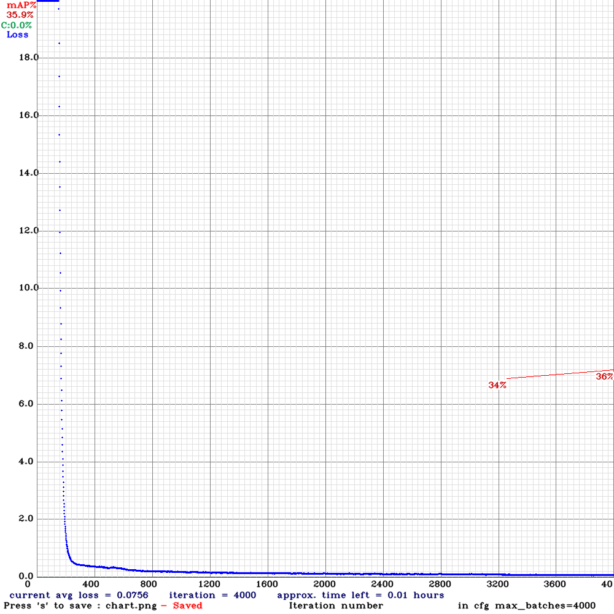

# Koalafinder

A YOLOv4 based solution for detecting koalas in thermal imaging

## Installation

### Ubuntu 18.04

```bash
sudo apt update && upgrade
sudo apt install python3
python3 -m pip install --upgrade pip
git clone https://github.com/realtimshady1/Koalafinder.git
cd Koalafinder
python3 -m pip install --upgrade -r requirements.txt

```

## Labelling

The program that is used for labelling can be installed through the following repository [DarkLabel](https://github.com/darkpgmr/DarkLabel)

Otherwise, a pre-configured executable is available in the 	`tools/` folder

## Setup

### Dataset

The koala data needs to be downloaded from the [Google Drive](https://drive.google.com/drive/folders/1v_w4-pkDTD1CF5tU2WWyccbrTg-8ra98?usp=sharing) into a new `obj` folder the `data/` folder along with the annotations in the following structure

```bash

└───data
    ├───DJI_0026.MP4
    └───obj
        ├───DJI_0026_00001.jpg
        ├───DJI_0026_00001.txt
        ├───DJI_0026_00002.jpg
        ├───DJI_0026_00002.txt
        └───...

```
The training data split files `[test.txt train.txt valid.txt]` are generated using the `write_dataset.py` script
```bash
python3 write_datasets.py 70 15 data/obj
```

### YOLOv4

#### GPU

Ideally there is a GPU provided for YOLO to run on but it doesn't necessarily need one. The following sections continue with the assumption that there is a GPU to train with. In the future, a section will be made for how to build without the use of a GPU.

Make sure that the correct GPU toolkit are installed. Run the following commands to verify that the versions are correct.

```bash
nvidia-smi
/usr/local/cuda/bin/nvcc --version

```

#### Build

To build YOLOv4 to run as the primary object detector, we need to clone [AlexyAB@github](https://github.com/AlexeyAB)'s darknet repository and build according to their instructions. This is necessary so that YOLOv4 can run efficiently on your specific machine.

For the sake of convenience, a pre-built YOLOv4 is available in the `darknet/` folder according to the following specifications. Thus if your environment meets the following constraints, you may skip the **Build** step.

Component | Version
--- | --- 
GPU | Tesla T4 
CUDA | 11.0
NVCC | 11.0.221  
cuDNN | 8.0.5  
OpenCV | 3.2.0
 

```bash
# Build
git clone https://github.com/AlexeyAB/darknet
cd darknet
sed -i 's/OPENCV=0/OPENCV=1/' Makefile
sed -i 's/GPU=0/GPU=1/' Makefile
sed -i 's/CUDNN=0/CUDNN=1/' Makefile
sed -i 's/CUDNN_HALF=0/CUDNN_HALF=1/' Makefile
sed -i 's/LIBSO=0/LIBSO=1/' Makefile
sudo make
```

Copy the files to the working directory

```bash
# Copy files
cp darknet ../Koalafinder/
cp darknet.py ../Koalafinder/
cp libdarknet.so ../Koalafinder/
cd ../
```

> Build errors attributed to `/bin/sh: 1: nvcc: not found` can be fixed by directing `NVCC=nvcc` to the location of CUDA's NVCC location. Usually `nvcc` is stored at `/usr/local/cuda/bin/nvcc`

### Config

A config file is needed to run the YOLO model and the parameters can be modified to suit each different application

The following is a recommendation on how best to tune the YOLO model configuration

```python

batch = 64
subdivisions = 1
width = 512 but anything divisible by 32 is fine
height = 512 the same as width
max_batches = (# of classes) * 2000 but no less than 4000
steps = (80% of max_batches), (90% of max_batches)
filters = (# of classes + 5) * 3

```

## Usage

### Training

Training the neural network can be completed using 

```bash
./darknet detector train obj.data yolov4-tiny.cfg yolov4-tiny.conv.29 -dont_show -ext_output -map

```

### Evaluate

Evaluate the neural network on the test dataset

```bash
./darknet detector map obj.data yolov4-tiny.cfg backup/yolov4-tiny_best.weights -points 0

```

### Test

Test the neural network on one image. This should be one from the test.txt dataset

```bash
./darknet detector test obj.data yolov4-tiny.cfg backup/yolov4-tiny_best.weights data/obj/DJI_0026_00001.jpg -ext_output

```

The neural network will generate a `predictions.jpg` file as the output

### Inference

To perform inference on a test image
```bash
python3 yolov4_image.py yolov4-tiny.cfg obj.data backup/yolov4-tiny_best.weights data/obj/DJI_0026_00001.jpg
```

To perform inference on a test video
```bash
python3 yolov4_video.py yolov4-tiny.cfg obj.data backup/yolov4-tiny_best.weights data/DJI_0026.MP4
```

## Progress

The most recent run example is shown here




